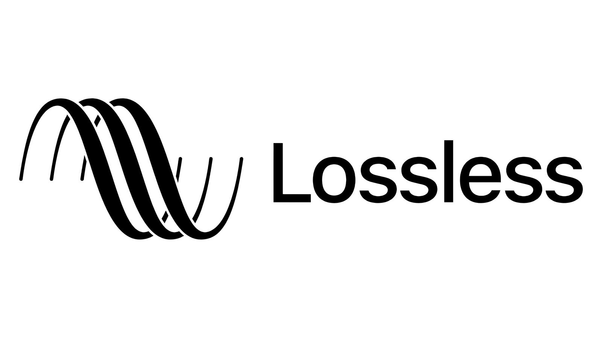

    
    <h1>ViMusic</h1>
    
Una aplicación para reproducir música

---

  
  
  

  
  
  

## Features
- Reproduce (casi) cualquier canción o vídeo de YouTube Music
- Reproducción en segundo plano
- Caché de fragmentos de audio para reproducción sin conexión
- Búsqueda de canciones, álbumes, vídeos de artistas y listas de reproducción.
- Marcar artistas y álbumes.
- Importar listas de reproducción
- Buscar, mostrar y editar letras de canciones o letras sincronizadas
- Gestión de listas de reproducción locales
- Reordenar canciones en lista de reproducción o cola
- Tema claro/oscuro/dinámico
- Saltar el silencio
- Tiempo de dormir
- Normalización de audio
-Android Auto
- Cola persistente
- Abrir enlaces de YouTube/YouTube Music (`ver`, `lista de reproducción`, `canal`)

## Expresiones de gratitud
- [**YouTube-Internal-Clients**](https://github.com/zerodytrash/YouTube-Internal-Clients): Un script de Python que descubre clientes API de YouTube ocultos. Sólo un proyecto de investigación.
- [**ionicons**](https://github.com/ionic-team/ionicons): Íconos premium hechos a mano creados por Ionic, para aplicaciones Ionic y aplicaciones web en todas partes.

<a href="https://www.flaticon.com/authors/ilham-fitrotul-hayat" title="music icons">Icono de aplicación basado en el icono creado por Ilham Fitrotul Hayat - Flaticon</a>

## Descargo de responsabilidad
Este proyecto y su contenido no están afiliados, financiados, autorizados, respaldados ni asociados de ninguna manera con YouTube, Google LLC o cualquiera de sus afiliados y subsidiarias.

Cualquier marca comercial, marca de servicio, nombre comercial u otros derechos de propiedad intelectual utilizados en este proyecto son propiedad de sus respectivos propietarios.
